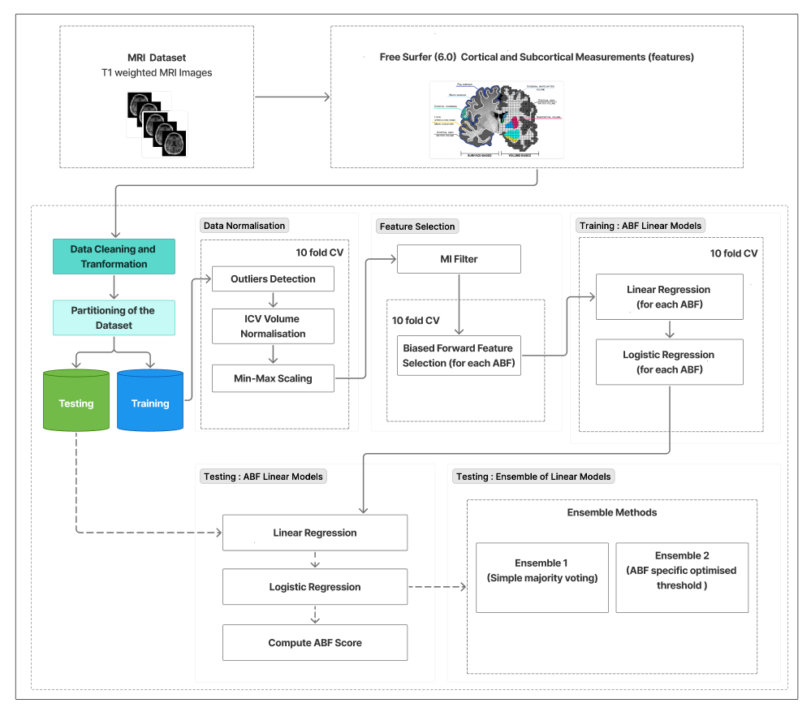

# 🧠 Interpretable MRI-Based Biomarkers for Alzheimer’s Disease Classification

## 📌 Overview

This repository accompanies the research work titled **"Interpretable MRI-Based Biomarkers for Alzheimer’s Disease Classification"**.
The project focuses on developing explainable machine learning approach to identify biomarkers from cross-sectional MRI data for early detection and classification of Alzheimer's Disease (AD). We propose an ensemble of linear models for AD classification, combining re-
gression and classification techniques for a novel methodology to identify potential biomarkers from MRI data, termed Apparent Brain Features (ABF). These biomarkers represent morphological brain regions automatically selected to optimise classification accuracy while preserving interpretability.

Our goal is to bridge the gap between high-performing AI models and clinical interpretability by providing transparent and reproducible workflows.

---

## 🎯 Objectives

* Develop robust models for Alzheimer's Disease classification using MRI data
* Extract **interpretable biomarkers** from neuroimaging data
* Provide **reproducible pipelines** for research and clinical applications

---

## 🧬 Dataset
* ADNI, AIBL, IXI, PPMI
* Modality: Structural MRI
* Type: Cross-sectional data
* Preprocessing includes:
  * FreeSurfer 6.0 Feature extraction
      * Skull stripping
      * Normalization
      * Registration
      * ROI extraction
  
    
> ⚠️ Note: Due to data privacy restrictions, the dataset is not included. Instructions for accessing publicly available datasets (e.g., ADNI, AIBL, IXI, PPMI,) are provided below.

---

### 🧠 Methodology Overview

<p align="center">
  
</p>

### 1. Preprocessing Pipeline

* Extreme Outliers detection
* ICV Normalisation of volumes
* Scaling features

### 2. Feature Selection

* Mutual information (MI filter)
* Biased Forward Feature Selection

### 3. Model Development

* Machine Learning models (e.g., Linear Regression, Logistic Regression)

### 4. Ensemble Method
* Ensemble 1: Majority voting
* Ensemble 2: Optimized method

### 4. Interpretability

* Apparent Brain Features (ABF Models)
* Model explanation techniques (e.g., ABF Score)
* Identification of clinically relevant biomarkers

---

## 📊 Results

* High classification performance across AD and CN groups
* Improved interpretability compared to black-box models
* Identification of key brain regions associated with disease progression

> Detailed metrics (Accuracy, F1-score) are available in the paper.

---

## 🛠️ Repository Structure

```
├── data/                # Data handling scripts (no raw data included)
├── preprocessing/       # MRI preprocessing pipelines scripts
├── results/             # Outputs, figures, and evaluation metrics
├── code/           # Jupyter notebooks for experiments
├── knime_workflows/     # KNIME pipelines (for Ensemble method)
└── README.md
```

---

## ⚙️ Installation

```bash
git clone https://github.com/AliBhatti21/Interpretable-MRI-Based-Biomarkers-for-Alzheimer-s-Disease-Classification.git
cd 

```
---

## 🔍 Reproducibility

* Fixed random seeds for experiments
* Clear pipeline separation (preprocessing → training → evaluation)
* Modular design for easy experimentation

---

## 📄 Publication

**Title:** Interpretable MRI-Based Biomarkers for Alzheimer’s Disease Classification
**Authors:** H. M. Ali Bhatti et al.
**Conference/Journal:** Brain Informatics (Bari, Italy)
**Year:** 2025

📎 [Link to paper]
📎 [Read the Paper](paper/paper.pdf)
---

## 🤝 Contributions

Contributions are welcome! Please open an issue or submit a pull request for improvements or discussions.

---

## 📬 Contact

* Name: Muhammad Ali Bhatti
* Email: Bhatti.hafizali@gmail.com
* LinkedIn: www.linkedin.com/in/muhammad-ali-bhatti-281409314

---

## ⭐ Acknowledgements

* ANVUR (PNRR scholarship funding source)
* Open datasets and research community contributions
